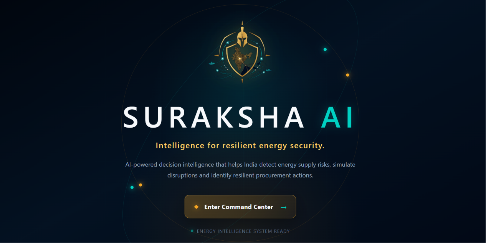

\# 🛡️ Suraksha AI


\### AI-powered Decision Intelligence for Resilient Energy Security


<p align="center">

&#x20; 

</p>


\---


\## 🌍 What is Suraksha AI?


Suraksha AI is an intelligent web platform designed to help organizations monitor energy supply networks, analyze potential risks, simulate disruption scenarios, and receive AI-powered recommendations for procurement and decision-making.


By combining data visualization, predictive analysis, and generative AI, Suraksha AI enables faster, smarter, and more informed responses to supply-chain disruptions.


\---


\## 🚀 What Can Suraksha AI Do?


\- 🤖 AI-powered Copilot for decision support

\- 📊 Interactive dashboard for monitoring energy networks

\- 🗺️ Visualize supply routes and risk locations

\- ⚠️ Identify high-risk transportation routes

\- 🔄 Simulate disruption scenarios

\- 📈 Compare procurement strategies

\- 📉 Monitor baseline risk trends

\- 💡 Generate intelligent recommendations using AI


\---


\## 🔮 Future Scope


Suraksha AI can be extended to support:


\- 🌐 Real-time energy market integration

\- 📡 Live satellite and weather data

\- 🔔 Automated risk alerts

\- 📱 Mobile application

\- ☁️ Cloud deployment

\- 📄 PDF report generation

\- 🌍 Multi-country energy network monitoring

\- 🤝 Integration with government and enterprise systems


\---


\## 🛠️ Technology Stack


\### Frontend

\- React

\- Vite

\- Axios

\- Framer Motion

\- CSS


\### Backend

\- Python

\- FastAPI

\- Uvicorn

\- Groq API


\---


\## ⚙️ How to Run the Project


\### 1️⃣ Clone the Repository


```bash

git clone https://github.com/Thanvi-reddy/Suraksha-AI.git

cd Suraksha-AI

```


\---


\### 2️⃣ Start the Backend


```bash

cd backend


python -m venv venv


venv\\Scripts\\activate


pip install -r requirements.txt

```


Create a `.env` file inside the `backend` folder:


```env

GROQ\_API\_KEY=YOUR\_GROQ\_API\_KEY

```


Run the backend:


```bash

python -m uvicorn main:app --reload --port 8000

```


Backend URL:


```

http://localhost:8000

```


\---


\### 3️⃣ Start the Frontend


Open another terminal:


```bash

cd frontend


npm install


npm run dev

```


Frontend URL:


```

http://localhost:5173

```


\---


\## 👩‍💻 Team


\*\*Yeturu Thanvi\*\*


AI \& Machine Learning Graduate


GitHub: https://github.com/Thanvi-reddy


\---


\## 🏆 Hackathon Project


Suraksha AI was developed as a hackathon solution to improve energy resilience using Artificial Intelligence, predictive risk analysis, and intelligent decision support.

